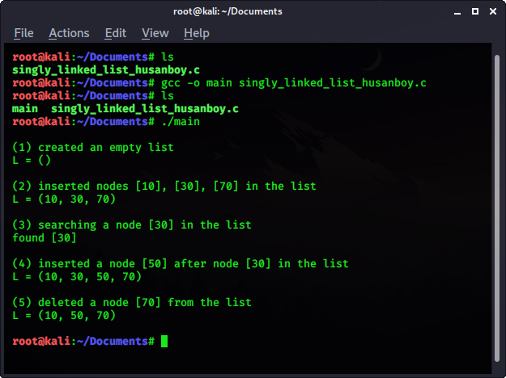

# singly-linked-list
<h1>This source-code shows the implementation of a Singly Linked List, one of the essential Data Structures & Algorithms.</h1>

Singly linked list is a collection of nodes linked together in a sequential way where each node of singly linked list contains a data field and an address field which contains the reference of the next node. Singly linked list can contain multiple data fields but should contain at least single address field pointing to its connected next node.

<b>Demonstrated operations include:</b> <i>Defining simple linked list, Defining head as the structure to indicate the beginning of the 
list, Empty list generation, Insertion algorithms as the last node and in the middle, Deletion algorithm, Search for nodes with data x in the list, Display function</i>  

